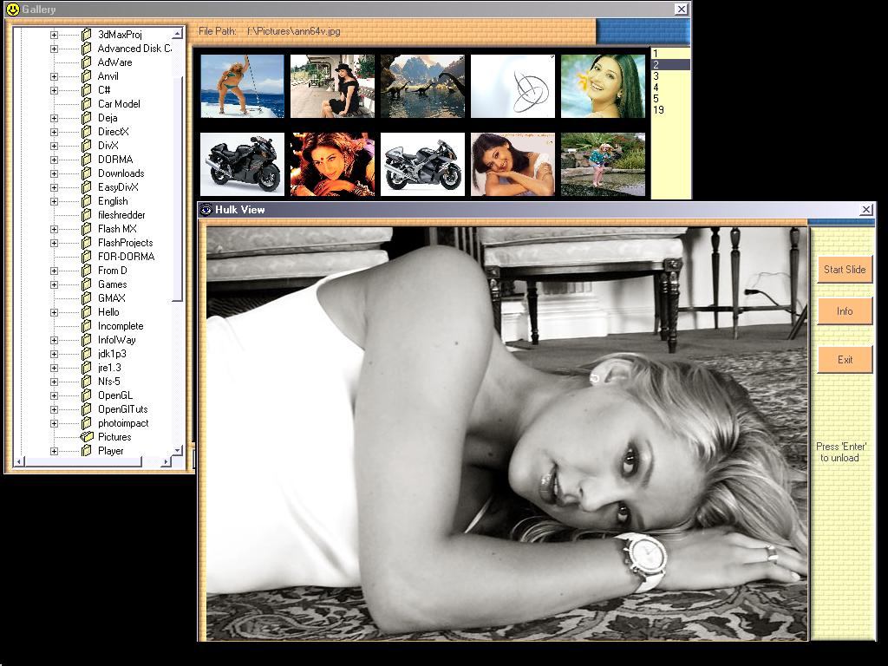



## Gallery \- Tree View

### Description

The code demonstrates the functionality of one of the most widely used window common control - the tree view control.
 
### More Info
 

             |
---                |---
**Submitted On**   |2003-09-24 18:47:12
**By**             |[Ajjo](https://github.com/Planet-Source-Code/PSCIndex/blob/master/ByAuthor/ajjo.md)
**Level**          |Intermediate
**User Rating**    |5.0 (20 globes from 4 users)
**Compatibility**  |VB 6\.0
**Category**       |[Custom Controls/ Forms/  Menus](https://github.com/Planet-Source-Code/PSCIndex/blob/master/ByCategory/custom-controls-forms-menus__1-4.md)
**World**          |[Visual Basic](https://github.com/Planet-Source-Code/PSCIndex/blob/master/ByWorld/visual-basic.md)
**Archive File**   |[Gallery\_\-\_1894125292005\.zip](https://github.com/Planet-Source-Code/ajjo-gallery-tree-view__1-60792/archive/master.zip)

